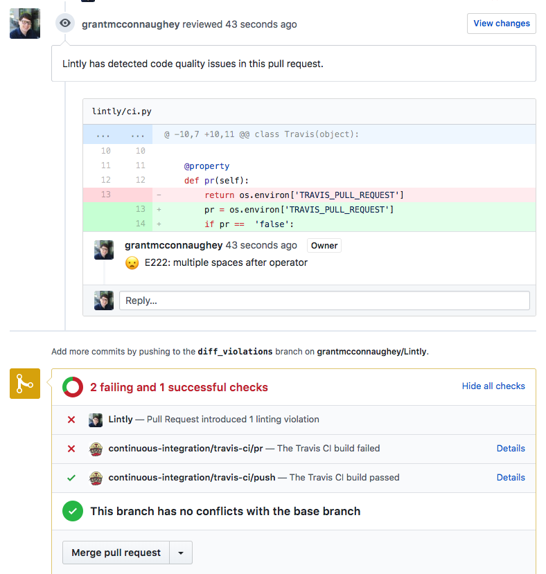

# Lintly

[](https://travis-ci.org/grantmcconnaughey/Lintly) [](https://codecov.io/gh/grantmcconnaughey/lintly)

Slurp up linter output and send it to a GitHub PR review. The CLI version of [lintly.com](https://lintly.com).

## Usage

First, `pip` install lintly:

    $ pip install lintly

Next, set the `LINTLY_API_KEY` environment variable to your GitHub API Key:

    $ export LINTLY_API_KEY="12345"

Finally, pipe the output of your linter to `lintly`:

    $ flake8 | lintly

Now you will see linting errors in your Pull Requests! Nifty!



## Support Git Services

- GitHub

> Support for GitLab and Bitbucket is planned.

## Supported Linters

- [flake8](http://flake8.pycqa.org/en/latest/)
    ```
    $ flake8 | lintly --format=flake8
    ```
- [pylint](https://www.pylint.org/)
    - For pylint you must use the `json` output format.
    ```
    $ pylint . --output-format=json | lintly --format=pylint-json
    ```
- [eslint](https://eslint.org/)
    ```
    $ eslint . | lintly --format=eslint
    ```
- [stylelint](https://stylelint.io/)
    ```
    $ stylelint . | lintly --format=stylelint
    ```

Additional linters can be added by modifying the `lintly/parsers.py` module.

## Configuration

At a minimum Lintly needs to know the following information to determine how to post the correct GitHub PR Review:

- GitHub API key
    - Generate your own [API Key here](https://github.com/settings/tokens/new). The API key will need the following GitHub scopes:
        - `repo:status` so that Lintly can post commit statuses on PRs.
        - `public_repo` so that Lintly can create pull request reviews on public repos.
        - `repo` so that Lintly can create pull request reviews on private repos.
- GitHub repository
    - This is your repository in the format `grantmcconnaughey/lintly`.
    > Note: Some Continuous Integration platforms will provide this value automatically.
- Pull Request number
    > Note: Some Continuous Integration platforms will provide this value automatically.

These configuration values can be provided to Lintly via environment variables or by being passed in as arguments to the Lintly CLI.

## Using Lintly with Continuous Integration platforms

Lintly works out of the box with the following Continuous Integration platforms:

- [Travis CI](#travis-ci)
- Circle CI
- AppVeyor
- Shippable
- Semaphore
- CodeBuild

When using these Continuous Integration platforms the repository, pull request number, and commit SHA will be provided automatically.

### Travis CI

To use with Lintly with Travis CI, add the following to your `.travis.yml` config file:

```yml
language: python

jobs:
  include:
    - stage: lint
      install: pip install lintly
      script: flake8 | lintly

stages:
  - lint
```

## To-Do

- Fix linters that output absolute paths
- Configuration to post either a PR comment or PR review
- Link to Build URL from commit status
- Support for config file
- Documentation
- Auto-detect formats
