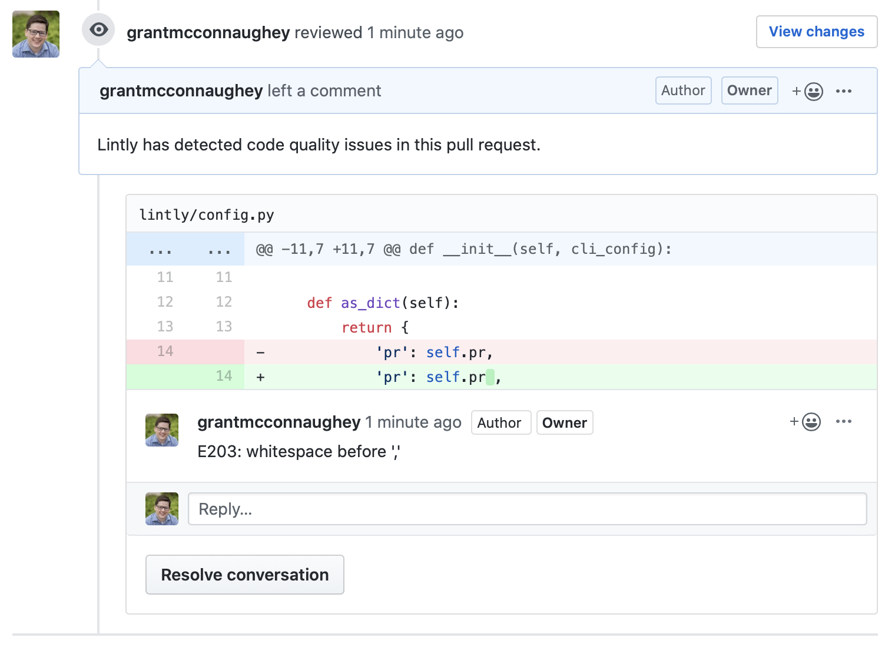
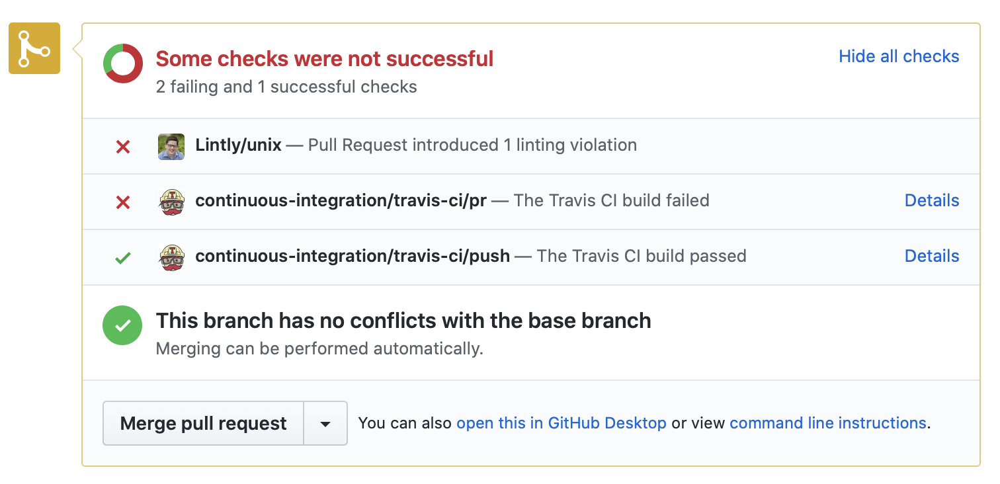

# Lintly

[](https://travis-ci.org/grantmcconnaughey/Lintly) [](https://codecov.io/gh/grantmcconnaughey/lintly)

Automated GitHub PR code reviewer for Python, JavaScript, CSS, and more.

## Usage

First, `pip` install lintly:

    $ pip install lintly

> Lintly requires Python 2.7 or 3.4+.

Next, set the `LINTLY_API_KEY` environment variable to your GitHub API Key:

    $ export LINTLY_API_KEY="12345"

Finally, pipe the output of your linter to the `lintly` script:

    $ flake8 | lintly

Now you will see a review with linting errors...



...and a commit check...



...on your pull requests! Nifty! 🎉

## Supported Linters

- [flake8](http://flake8.pycqa.org/en/latest/)
    ```
    $ flake8 | lintly --format=flake8
    ```
- [black](https://black.readthedocs.io/en/stable/)
    ```
    $ black --check | lintly --format=black
    ```
- [pylint](https://www.pylint.org/)
    - For pylint you must use the `json` output format.
    ```
    $ pylint . --output-format=json | lintly --format=pylint-json
    ```
- [eslint](https://eslint.org/)
    ```
    $ eslint . | lintly --format=eslint
    ```
- [stylelint](https://stylelint.io/)
    ```
    $ stylelint . | lintly --format=stylelint
    ```

- [cfn-lint](https://github.com/aws-cloudformation/cfn-python-lint)
    ```
    $ cfn-lint template.yaml | lintly --format=cfn-lint
    ```

- [cfn-nag](https://github.com/stelligent/cfn_nag)
    ```
    $ cfn_nag_scan --input-path cloudformation-template.yaml --output-format=json | lintly --format=cfn-nag
    ```

Additional linters can be added by modifying the `lintly/parsers.py` module.

## Configuration

At a minimum Lintly needs to know the following information to determine how to post the correct GitHub PR Review:

- **GitHub API key** (`--api-key` or `LINTLY_API_KEY` env var)
    - Generate your own [API Key here](https://github.com/settings/tokens/new). The API key will need the following GitHub scopes:
        - `repo:status` so that Lintly can post commit statuses on PRs.
        - `public_repo` so that Lintly can create pull request reviews on public repos.
        - `repo` so that Lintly can create pull request reviews on private repos.
- **GitHub repository** (`--repo` or `LINTLY_REPO` env var)
    - This is your repository in the format `grantmcconnaughey/lintly`.
    > Note: Most Continuous Integration platforms will provide this value automatically.
- **Pull Request number** (`--pr` or `LINTLY_PR` env var)
    > Note: Most Continuous Integration platforms will provide this value automatically.

These configuration values can be provided to Lintly via environment variables or by being passed in as arguments to the Lintly CLI.

### Options

A list of all configuration values can be viewed by running `lintly --help`.

```
Usage: lintly [OPTIONS]

  Slurp up linter output and send it to a GitHub PR review.

Options:
  --api-key TEXT                  The GitHub API key to use for commenting on
                                  PRs (required)
  --repo TEXT                     The GitHub repo name in the format
                                  {owner}/{repo}
  --pr TEXT                       The pull request number for this build
                                  (required)
  --commit-sha TEXT               The commit Lintly is running against
                                  (required)
  --format [unix|flake8|pylint-json|eslint|eslint-unix|stylelint|black|cfn-lint|cfn-nag]
                                  The linting output format Lintly should
                                  expect to receive. Default "flake8"
  --context TEXT                  Override the commit status context
  --fail-on [any|new]             Whether Lintly should fail if any violations
                                  are detected or only if new violations are
                                  detected. Default "any"
  --post-status / --no-post-status
                                  Used to determine if Lintly should post a PR
                                  status to GitHub. Default true
  --request-changes / --no-request-changes
                                  Whether Lintly should post violations as a
                                  PR request for changes instead of a comment
                                  review. Default true
  --use-checks / --no-use-checks  Whether Lintly should try to use the GitHub
                                  Checks API to report on changes requested.
                                  This only works when running in GitHub
                                  Actions. Default false
  --log                           Send Lintly debug logs to the console.
                                  Default false
  --exit-zero / --no-exit-zero    Whether Lintly should exit with error code
                                  indicating amount of violations or not.
                                  Default false
  --help                          Show this message and exit.
```

## Supported Continuous Integration platforms

Lintly works out of the box with all of the CI platforms supported by [ci.py](https://github.com/grantmcconnaughey/ci.py#ci-services). To add support for new CI platforms create a PR to the ci.py repo.

When using these Continuous Integration platforms the repository, pull request number, and commit SHA will be detected automatically.

### GitHub Actions example

To use Lintly with GitHub Actions, create a file called `.github/workflows/lint.yaml` with the following contents:

```yaml
name: Lint

on: [pull_request]

jobs:
  lint:
    runs-on: ubuntu-latest
    steps:
    - uses: actions/checkout@v2
    - name: Set up Python
      uses: actions/setup-python@v1
      with:
        python-version: 3.8
    - name: Install dependencies
      run: pip install flake8 lintly
    - name: Lint with flake8
      run: flake8 | lintly --commit-sha=${{ github.event.pull_request.head.sha }}
      env:
        LINTLY_API_KEY: ${{ secrets.GITHUB_TOKEN }}
```

### Travis CI example

To use with Lintly with Travis CI, add the following to your `.travis.yml` config file:

```yml
language: python

jobs:
  include:
    - stage: lint
      install: pip install lintly
      script: flake8 | lintly --format=flake8

stages:
  - lint
```
